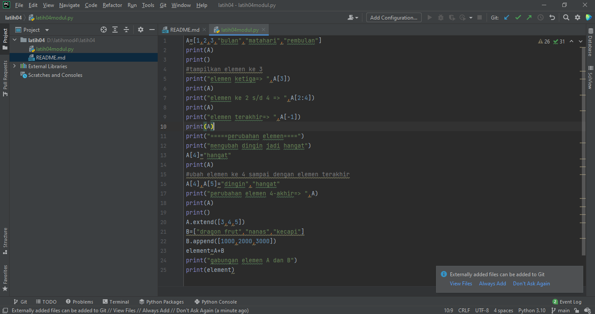

# latih04
Latihan

• Buat sebuah list sebanyak 5 elemen dengan nilai bebas

• akses list:

• tampilkan elemen ke 3

• ambil nilai elemen ke 2 sampai elemen ke 4

• ambil elemen terakhir

• ubah elemen list:

• ubah elemen ke 4 dengan nilai lainnya

• ubah elemen ke 4 sampai dengan elemen terakhir

• tambah elemen list:

• ambil 2 bagian dari list pertama (A) dan jadikan list ke 2 (B)

• tambah list B dengan nilai string

• tambah list B dengan 3 nilai

• gabungkan list B dengan list A

Berikut Programnya:

dan berikut hasil outputnya:

itu lah program nya terimakasih.

